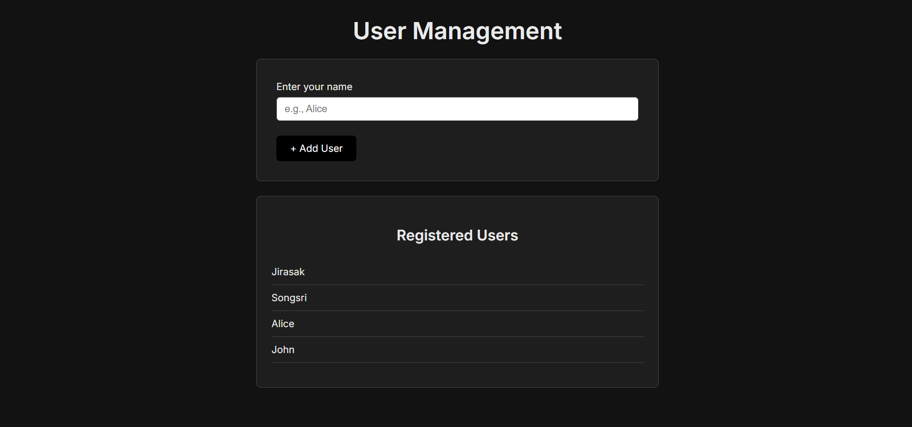

# 🚀 User Management App (Go + React/Vite)

A modern and minimalist full-stack application for managing user registrations. Built with Go for the backend API and React (Vite TypeScript) for a sleek, intuitive user interface. This project demonstrates basic CRUD operations and a clean architectural setup.

## ✨ Features

-   **User Registration:** Easily add new users to the system.
-   **User Listing:** View all registered users in a clean, scrollable list.
-   **Responsive Design:** Optimized for various screen sizes (implied by modern CSS).
-   **RESTful API:** Robust backend for efficient data handling.
-   **Minimalist UI:** Clean, modern, and dark-themed user experience.

## 📸 Demo


## 🛠️ Tech Stack

### Backend
-   **Go:** Powerful and efficient programming language.
-   **Gin Gonic:** High-performance HTTP web framework.
-   **Basic In-memory Storage:** For demonstration purposes (can be easily extended to a database).

### Frontend
-   **React:** A JavaScript library for building user interfaces.
-   **Vite:** Fast build tool for modern web projects.
-   **TypeScript:** Type-safe JavaScript for enhanced developer experience.
-   **CSS Modules:** For encapsulated and maintainable component styling.

## 🚀 Getting Started

These instructions will get you a copy of the project up and running on your local machine for development and testing purposes.

### Prerequisites

Make sure you have the following installed:
-   [Go](https://golang.org/doc/install) (version 1.18 or higher recommended)
-   [Node.js](https://nodejs.org/en/download/) (version 14 or higher recommended)
-   [npm](https://www.npmjs.com/get-npm) (comes with Node.js) or [Yarn](https://yarnpkg.com/getting-started/install)
-   [Git](https://git-scm.com/book/en/v2/Getting-Started-Installing-Git)

### Installation

1.  **Clone the repository:**
    ```bash
    git clone https://github.com/Jirasak-Guy/my-fullstack-app
    cd my-fullstack-app
    ```

2.  **Backend Setup (Go):**
    ```bash
    cd backend
    go mod tidy 
    go run cmd/main.go
    ```
    *The Go backend server will start on `http://localhost:8080`.*
    *(Leave this terminal open)*

3.  **Frontend Setup (React/Vite):**
    ```bash
    cd ../frontend 
    npm install    
    npm run dev
    ```
    *The React development server will start on `http://localhost:5173`.*
    *(Leave this terminal open)*

## 💡 Usage

Once both the backend and frontend servers are running:

1.  Open your web browser and navigate to: `http://localhost:5173/`
2.  In the "User Management" form, enter a name (e.g., "Alice").
3.  Click the "Add User" button. The user should appear in the "Registered Users" list below.
4.  You can also directly access the backend API at `http://localhost:8080/users` to see the stored user data (should return `[]` initially, or `[{"name":"Alice"}]` after adding).

## 📂 Project Structure
```
.
├── go-backend/
│   ├── cmd/
│   │   └── main.go         # Backend entry point
│   ├── internal/
│   │   ├── models/         # User data model and in-memory store
│   │   └── handlers/       # API handlers (e.g., getUsers, addUser)
│   ├── go.mod
│   └── go.sum
└── frontend/
├── src/
│   ├── App.tsx         # Main React component
│   ├── main.tsx        # React app entry point
│   ├── index.css       # Global styles
│   ├── components/
│   │   ├── UserForm.tsx          # Form for adding users
│   │   └── UserList.tsx          # Component to display user list
│   ├── services/       # API interaction logic (userService.ts)
│   └── types/          # TypeScript type definitions (user.d.ts)
├── index.html
├── package.json
└── vite.config.ts
```